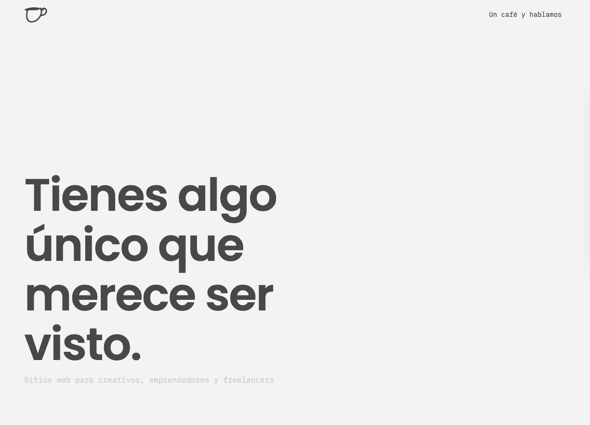

# 🚀 Quick start

## Example Site
[]

## Overview
Repositorio con todo el proyecto en wordpress [Repo](https://github.com/okvianey/flatlatte-wp)
* Repo con proyecto desplegado - [Repo](https://github.com/okvianey/flatlatte-website)
* Se usó simply static para crear el sitio estatico

<!-- resources -->
### Resources
Some third-party plugins that we used to build this template. Please check their license.

* **Google Fonts**: <http://fonts.google.com/>

## Author

☕️ Made with coffee & code by [okvianey](https://okvianey.github.io)
- Github - [@okvianey](https://github.com/okvianey)
- Instagram - [@okvianey](https://instagram.com/okvianey)